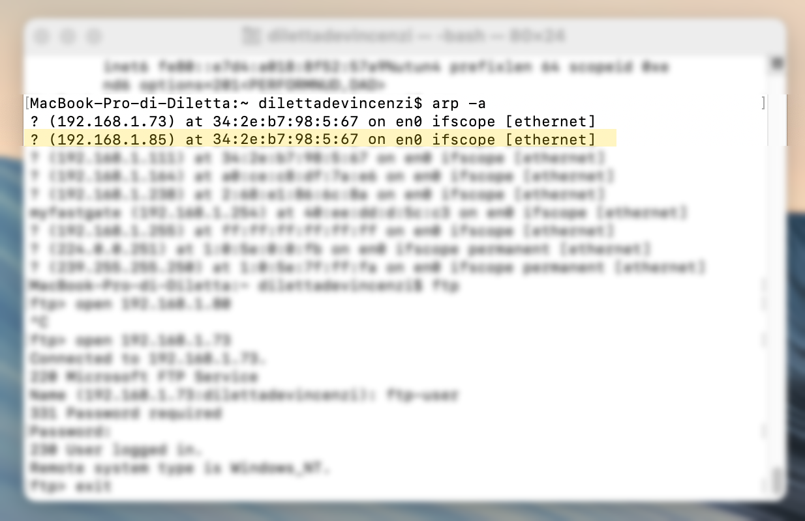
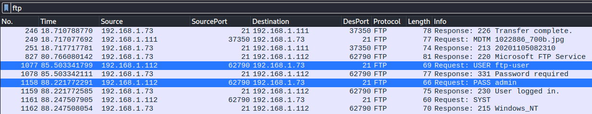
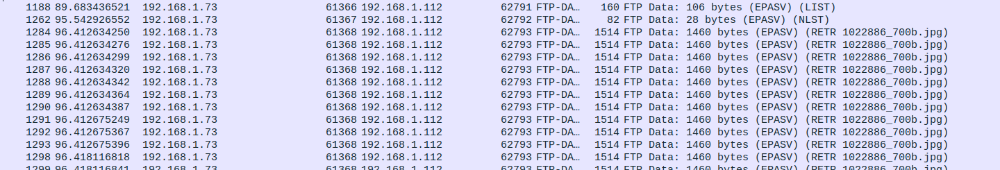

# Recuperar informaciones transmitidas por ftp (MITM) 

En este ejercicio, se explorará cómo recuperar informaciones de protocolo ftp como user, password o imagenes siendo el man in the middle. 
Voy a utilizar una Vm kali para hackear, mi pc host es donde vamos a acceder a las informaciones en ft y el mac sera el que vamos a escuchar.

### La lista de las ips por maquina
- Kali ( 192.168.1.111) hacker
- Mac (192.168.1.112) Usurpado
- W10 (192.168.1.73)  Victima y host
- Rooter (192.168.1.85)


## Pasos del ejercicio

1.  [Realizar un ataque de ARP poisoning](#realizar-un-ataque-de-arp-poisoning)
2.  [Explotar el ataque para capturar credenciales de inicio de sesión de FTP](#explotar-el-ataque-para-capturar-credenciales-de-inicio-de-sesi%C3%B3n-de-ftp)
3.  [Analizar el tráfico de red utilizando Wireshark](#analizar-el-tr%C3%A1fico-de-red-utilizando-wireshark)
4.  [Capturar imágenes a través de la red utilizando la técnica de ARP poisoning](#capturar-im%C3%A1genes-a-trav%C3%A9s-de-la-red-utilizando-la-t%C3%A9cnica-de-arp-poisoning)


### Realizar un ataque de ARP poisoning

En este paso, se utilizará la herramienta Ettercap para realizar un ataque de ARP poisoning y redirigir el tráfico de red a través de la máquina del atacante. Esto permitirá al atacante interceptar el tráfico de red y capturar información confidencial, como las credenciales de inicio de sesión. No utilizo la interaz ya que no conseguia hacer el arp poisoning. 
```bash
sudo ettercap -T -M arp:remote /192.168.1.112/192.168.1.85/
```
-  -T permite ejecutar ettercap en modo texto y no la app grapfica
- -M especifica el tipo de ataque. En nuestro cas 'arp' y 'remote' ya que queremos interceptar todo el trafico en este caso usurpamos el rooter. 
- 192.168.1.112 es la ip que tiene las informaciones que queremos interceptar
- 192.168.85 es la ip rooter

Verifico que el poisoning funciono bien 
```bash
arp -a
```
<br />




En la imagen podemos ver que esta bien la mac est la de la ip .73 que es la host de la maquina virtual.

### Explotar el ataque para capturar credenciales de inicio de sesión de FTP

Una vez que se ha realizado el ataque de ARP poisoning y se ha redirigido el tráfico de red a través de la máquina del atacante, se puede explotar el ataque para capturar las credenciales de inicio de sesión de FTP de las víctimas. Como el protocolo FTP no tiene cifrado, las credenciales de inicio de sesión pueden ser interceptadas y capturadas por el atacante. 

### Analizar el tráfico de red utilizando Wireshark

En este paso, se utilizará la herramienta Wireshark para analizar el tráfico de red entre las máquinas víctimas y el atacante. Esto permitirá al atacante examinar el tráfico de red y buscar información confidencial que pueda haber sido interceptada durante el ataque. Se ven el user y password en claro cuando el Mac se connecto en ftp al W10. ( ftp-user y admin)
<br />



### Capturar imágenes a través de la red utilizando la técnica de ARP poisoning

Por último, se puede utilizar la técnica de ARP poisoning para capturar imágenes a través de la red. Para hacerlo, se debe utilizar una herramienta de captura de paquetes como Wireshark para capturar el tráfico de red y buscar paquetes que contengan datos de imagen. Estos paquetes se pueden examinar y extraer para obtener las imágenes capturadas. En wireshark utilizo el filter 'ftp-data' para ver las imagenes. En la info hay un .jpg entonces ya se que es una imagen. Click derecho -> follow TCP STREAM -> Show Data to Raw -> Save as -> image.png.
El resultatdo es la imagen que se ha transmitido.
<br />



### Nota

Parte del texto escrito fue por chat gpt que me ayuda a escribir una documentacion mas profesional pero sigue siendo yo quien hizo el ejercicio. Si no te gusta me lo dices y escribo yo mismo la proxima vez. 